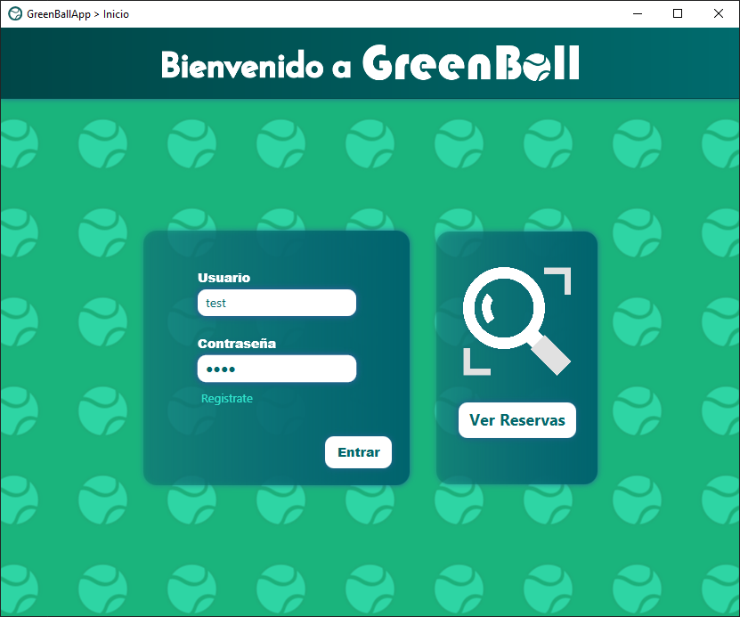
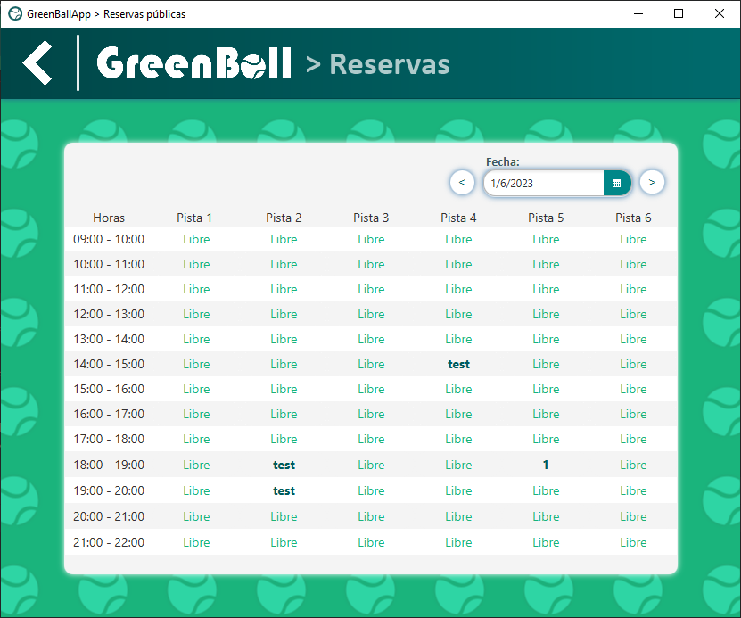
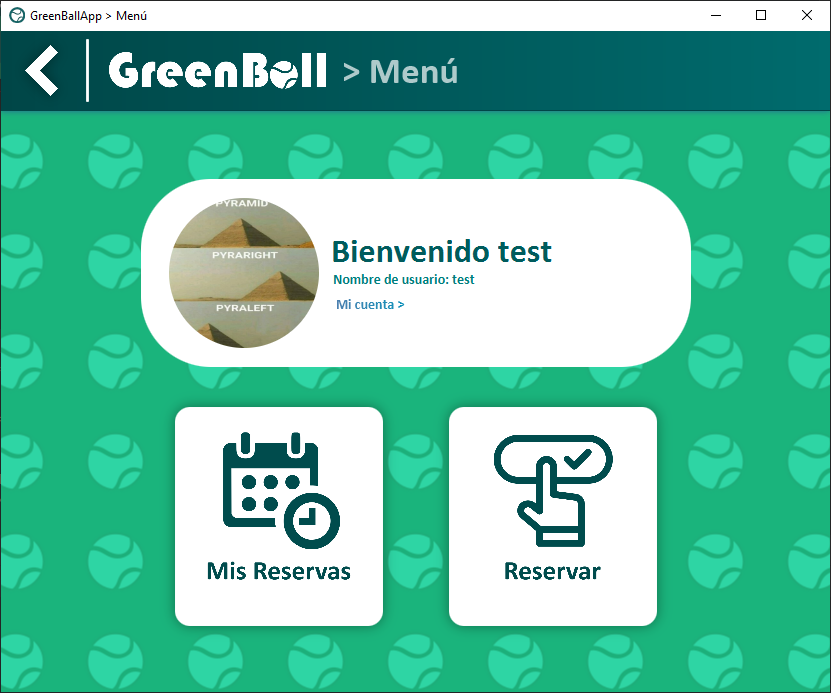
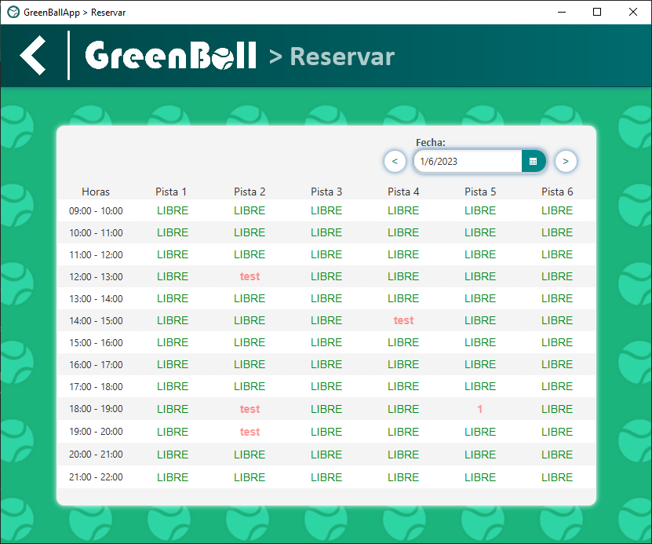
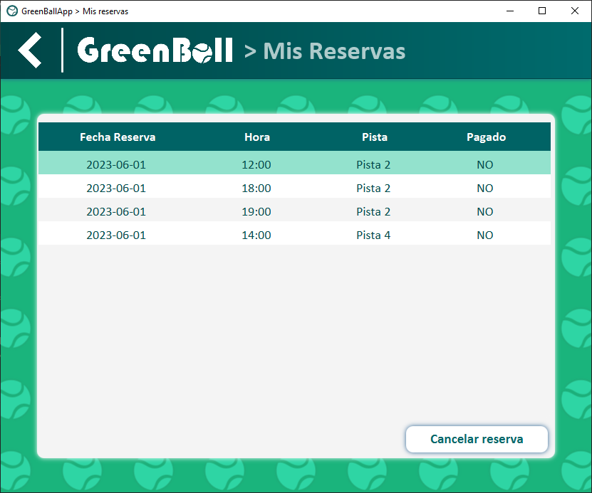
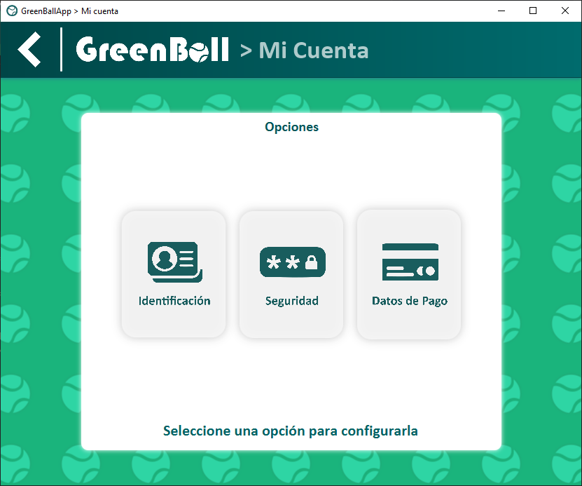

# GreenBallApp

Este proyecto es una aplicación desarrollada para la asignatura de **IPC** de la carrera de Ingeniería Informática de la **ETSINF UPV** con el IDE Intellj IDEA. Su objetivo principal es facilitar a los clientes la reserva y cancelación de pistas de tenis.

## Características principales

-   Sistema de login y registro para garantizar el acceso a la aplicación.
-   Funcionalidad para reservar y anular pistas de tenis según la disponibilidad.
-   Apartado para que los usuarios modifiquen su información personal.

## Dependencias
- Para el proyecto, hemos utilizado  la libreria JavaFx versión 17.0.6  disponible en [Gluon JavaFX](https://gluonhq.com/products/javafx/) .

 - Es necesario crear una variable de entorno en Intellj llamada **PATH_TO_FX** que indique la dirección de la carpera **lib** dentro de la libreria javaFX.

## Capturas

